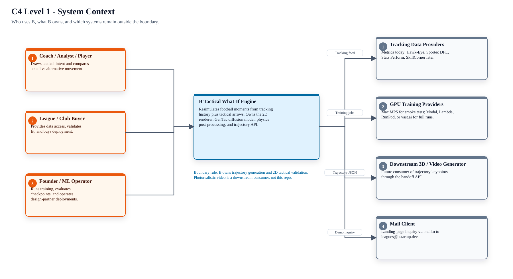
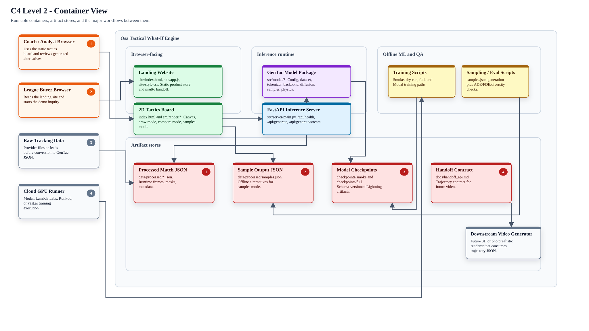
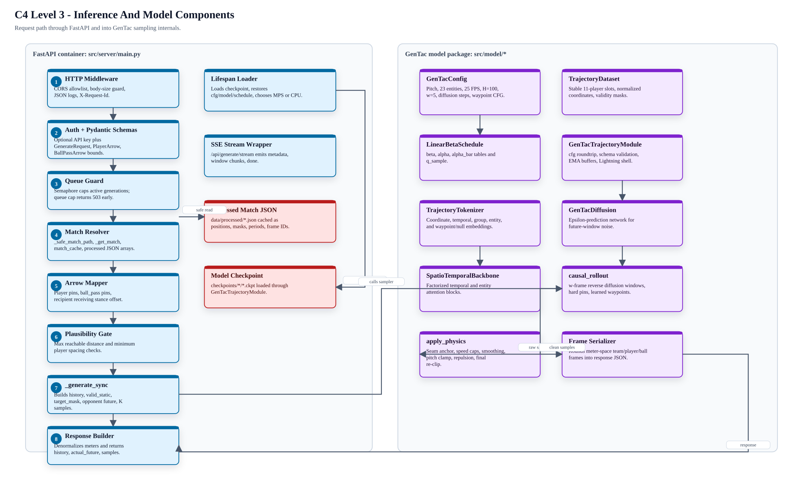
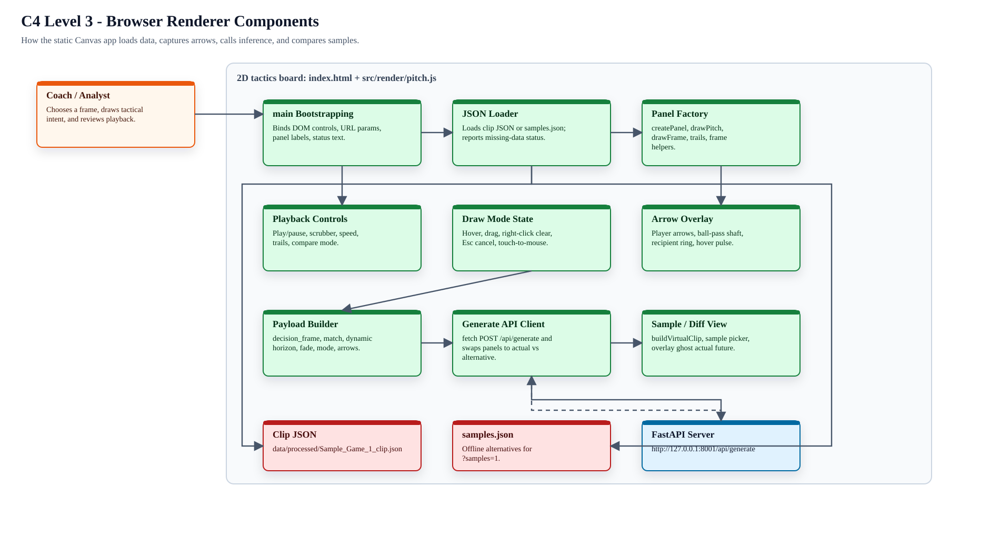
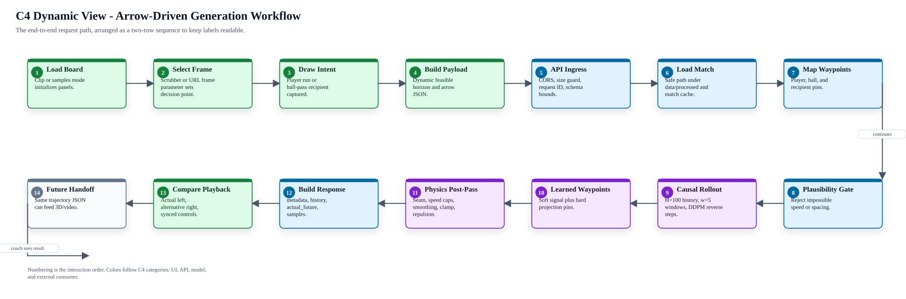
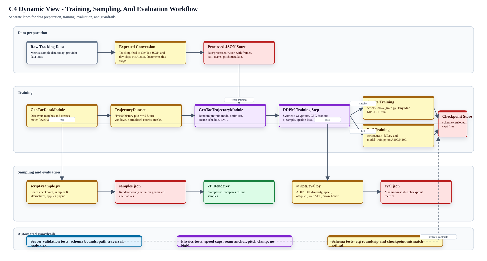
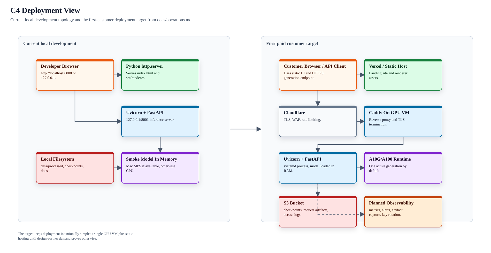

# Osa Tactical What-If Engine - C4 Workflow Diagrams

This document maps the project using C4-style architecture views. It is grounded
in the current repository structure, especially `README.md`, `index.html`,
`src/render/pitch.js`, `src/server/main.py`, `src/model/*`, `scripts/*`, and
`docs/handoff_api.md`.

Browser view: [c4_workflow.html](c4_workflow.html).

## Scope And Assumptions

- The core product workflow is: load a match moment, draw tactical arrows,
  generate counterfactual trajectories, and compare actual vs alternative on a
  2D pitch.
- Runtime data and checkpoints are generated artifacts. The clean checkout
  inspected for this diagram does not include `data/` or `checkpoints/`, but the
  application and docs expect `data/processed/*.json`,
  `data/processed/samples.json`, and `checkpoints/*/*.ckpt`.
- The README references `src/data/metrica_to_gentac.py` and
  `src/data/extract_clip.py`, but `src/data/` is not present in this checkout.
  The diagrams therefore show tracking conversion as an expected offline ingest
  stage rather than an implemented runtime container.
- The photorealistic 3D/video layer is intentionally out of scope for this
  repo. This project owns trajectory generation and exposes a handoff contract
  for downstream rendering.

## Legend

| C4 concept | Meaning in these diagrams |
| --- | --- |
| Person | Coach, analyst, buyer, or operator interacting with the system |
| Software system | The product as a whole or an external system outside repo ownership |
| Container | Deployable or independently runnable part: browser UI, API server, scripts, stores |
| Component | Major code module inside a container |
| Data store | File or object-store backed artifact used by runtime or training |
| Dynamic view | Ordered workflow across containers and components |

## C4 Level 1 - System Context

## C4 Level 2 - Container View

## C4 Level 3 - Inference And Model Components

## C4 Level 3 - Browser Renderer Components

## C4 Dynamic View - Arrow-Driven Generation Workflow

## C4 Dynamic View - Training, Sampling, And Evaluation Workflow

## C4 Deployment View - Current Local State And First-Customer Target

## Architectural Notes

- The browser renderer is deliberately static and framework-free. It expects the
  processed JSON schema directly, so generated samples and ground-truth clips
  share the same rendering path.
- The API response intentionally matches `scripts/sample.py` output. That lets
  the same UI render offline samples and live arrow-conditioned inference.
- The model is held in memory at FastAPI startup. Request-time work is mostly
  match slicing, waypoint construction, diffusion sampling, physics
  post-processing, and response serialization.
- Safety and operability are already represented in code: path traversal guard,
  request body limit, bounded `k`, bounded horizon, bounded arrow count, optional
  API key, request IDs, queue cap, and checkpoint schema validation.
- Production readiness gaps remain operational rather than architectural:
  generated artifacts are local, there is no Dockerfile, metrics endpoint, alert
  routing, artifact capture, key rotation, HTTPS setup, or deployed GPU host yet.

## Source Grounding

| Area | Repository source |
| --- | --- |
| Product workflow and roadmap | `README.md`, `docs/product_vision.md`, `docs/mvp.md` |
| Browser UI workflow | `index.html`, `src/render/pitch.js`, `src/render/style.css` |
| Inference API and validation | `src/server/main.py`, `tests/test_server_validation.py` |
| Model internals | `src/model/config.py`, `dataset.py`, `tokenizer.py`, `backbone.py`, `diffusion.py`, `samplers.py`, `physics.py`, `lightning_module.py` |
| Training and evaluation | `scripts/smoke_train.py`, `scripts/train_full.py`, `scripts/modal_train.py`, `scripts/sample.py`, `scripts/eval.py`, `docs/cloud_training.md` |
| Handoff and deployment | `docs/handoff_api.md`, `docs/operations.md` |
